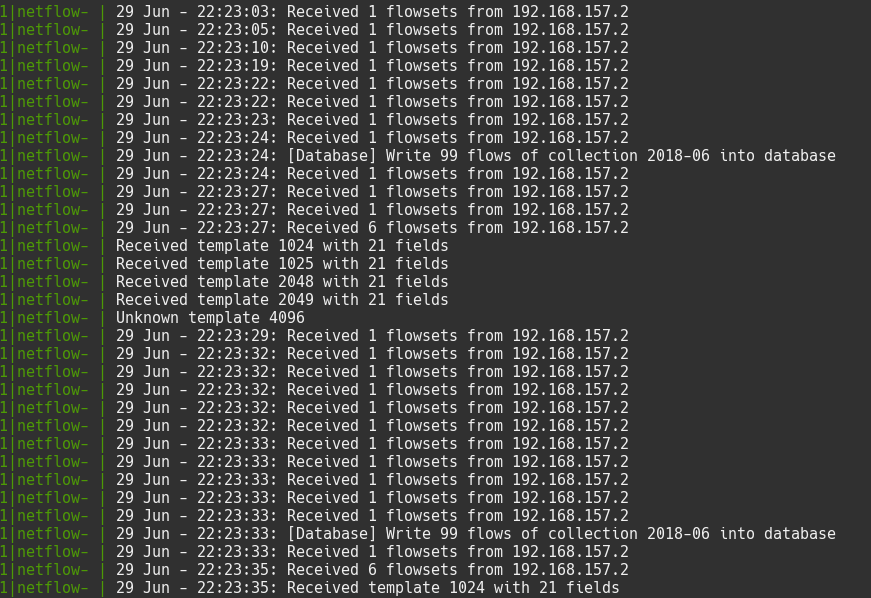

# NetflowCollector

[NetflowCollector](https://netflowcollector.howaner.de) is a java application which starts a udp server that can receive netflows from a router.  
This flows are written into a database which gives you excelent abilities to create own reporting/diagram scripts.

The software is built in java and can be builded with maven. See [Contribution](https://netflowcollector.howaner.de/docs/contribution.html) for more informations.

	

## License

Licensed under the [BSD-3](https://netflowcollector.howaner.de/docs/license.html) License.
